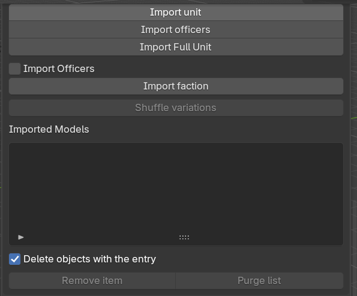
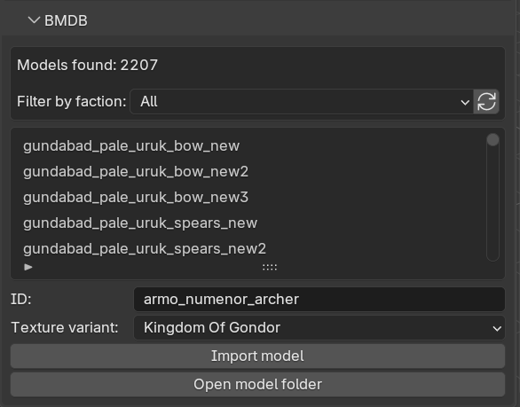
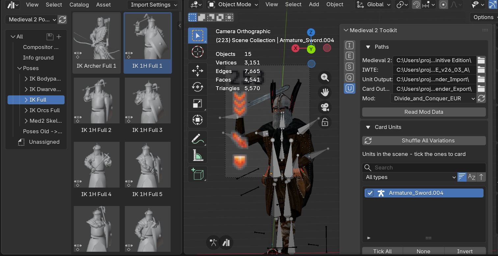
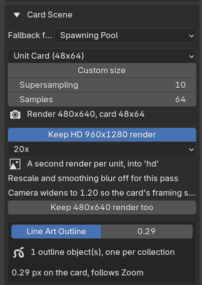
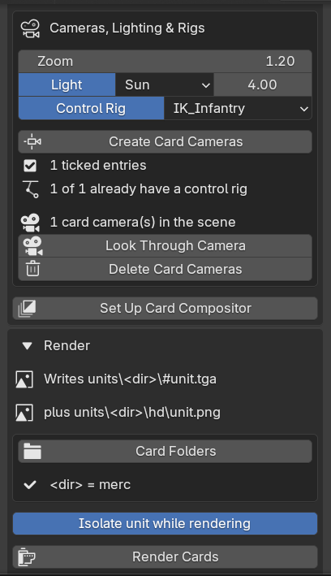
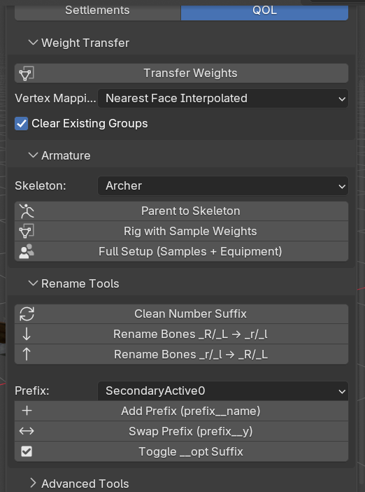

# Medieval 2: Total War - Blender Toolkit

This Blender addon is a complete asset pipeline for Medieval II: Total War modding. It imports the game's units, models and settlements straight into Blender, and exports finished models back into the game's formats — including textures, normal maps and a ready-made `battle_models.modeldb` entry — with IWTE handling the final `.mesh` conversion.

The addon is organised into five **workmodes**, selected from a dropdown at the top of the toolkit panel (N-panel → Medieval 2 Toolkit). Each workmode shows only the panels relevant to that stage of the pipeline.

> **Blender 5.0 or newer is recommended** — that is what the addon is developed and tested against.

***

 

## Table of Contents
* [Features](#features)
* [Usage](#usage)
* [Installation](#installation)
* [Credits](#credits)

## Features

### Unit Import
Read any mod's data folder and pull its content into Blender:
- Batch import every unit of a faction, or import single units and officers
- Import Faction brings in **every armour upgrade** of each unit, stacked upward on Z, plus an optional **Import Officers** toggle that places each unit's officers behind it
- Single unit import has tick boxes for the armour upgrade levels the unit actually has, each labelled with its model ID
- Import models directly from the battle_models.modeldb (BMDB) with faction filtering, and texture variants labelled "(Same as X)" so the genuinely unique ones stand out
- EDU-based unit browser with mount / officer / upgrade handling
- Imported Models list with a "Delete objects with the entry" toggle, so removing an entry also deletes the rig and everything parented to it
- Unit variation randomizer
- Batch import strategy `.cas` models

### Unit Export
Take a rigged model from Blender back into the game:
- One-click **Check Model for Export**: auto-fixes naming (`.001` suffixes, `x__y` part naming), collapses duplicate materials and material slots, validates weights, texture sizes and UV layout before anything leaves Blender
- One consistent export naming rule: `name` → `name__name`, `name1_name2` → `name1__name2`, and number-suffixed parts (`hair1`, `hair_1`) → `name__name_number`, with unresolvable `.001` clashes renumbered to `base_01`, `base_02`, ...
- Main/attach material auto-detection (`_at`/`attach`/`attachment` names, lone-material fallback) with any extra materials folded in automatically
- Per-texture UV checking: main-texture objects must sit in the first UV tile, attach-texture objects in the tile to the right, with an option to auto-select offending objects in the UV editor — plus an **Attempt to Auto-Assign UV** button
- GLB export with automatic texture conversion to the game's `.texture` format (DXT5, via bundled texconv), including non-DXT `.dds` sources (uncompressed, BC7, DX10 header) which are recompressed rather than skipped
- Any texture that cannot be converted is reported with a reason in the completion popup instead of failing silently
- Output renaming for all textures, and blank normal-map generation for materials without one
- BMDB entry generator: faction ownership toggles, sprite/footer copying from existing units, duplicate-entry warning against the mod's modeldb
- GLB → `.mesh` conversion driven through IWTE task files, with progress monitoring
- All export settings are stored per-armature, so multiple units can live in one .blend

### Unit Info (unit cards)
Render a whole faction's unit cards and unit info images without leaving Blender:
- **Import Units for Cards** brings in one armour upgrade of every unit of a faction, evenly spaced on X so each one can be framed on its own. Models and textures that are not on disk yet are extracted with IWTE first, exactly like the Unit Import workmode — nothing has to be converted by hand
- Variations are rolled down to one mesh per group on import, so a card never shows a pile of overlapping heads and weapons
- The Imported Models list gets a **tick box per unit**, plus a search box, A→Z / Z→A sorting and a foot / mounted / engine / added-by-hand filter, drawn above the list in both the Unit Import and Unit Info tabs
- Entries **remove themselves** when the armature they point at is deleted from the file (*Drop entries for deleted objects*, on by default). An object merely unlinked from the scene is left alone. Removing an entry with *Delete objects* on also takes the unit's control rig with it, rather than stranding it
- **Add Selected / Add All Unlisted** puts armatures that never came through the importer — hand-built units, a `.glb` dragged straight in — into the Imported Models list, so they can be given a card too. Selecting a control rig adds the skeleton it drives, not the controller
- **Create Card Cameras** gives every ticked unit — or, with nothing ticked, every selected armature — its own orthographic card camera, each carrying a sun aimed the same way at strength 4. Only the sun of the unit being rendered is lit, so fifty cameras do not stack fifty suns onto every card. Tick **Control Rig** in the same box and it also builds each unit's IK controller in one go, so the units can be posed before rendering; units that already have one are left as they are
- Cameras, suns and control rigs are all created **in the unit's own collection**, not loose in the scene, so a faction import stays organised
- Card presets for the 48x64 unit card, the 68x90 variant and the 180x230 info card, plus a custom size. **Supersampling** renders a whole multiple of the card and the compositor scales it back down — at the default of 10 a unit card renders at 480x640, the size the old card .blend files used
- The card compositor reproduces the old card .blend node tree, frame for frame: a *rescale* frame (bilateral blur at size 5 / threshold 1, then a Nearest Transform back to card size), a *Colour Adjust* frame (brightness/contrast bracketed by a pair of **Alpha Convert** nodes so it works on straight alpha, then gamma, exposure and RGB curves) and a *Sharpen* frame (Diamond Sharpen at 0.2, then hue/saturation). Because the rescale comes first, the sharpen bites at final card pixel size, which is what gives those cards their crispness. The old *Border Size* frame is not reproduced: it held nothing visual and only existed to crop the output canvas, which no Blender 5 node can do any more — the card is cut out of the middle of the frame when it is saved instead
- **Line Art Outline** (on by default) adds one Grease Pencil **Collection Line Art** object per unit collection, each outlining only its own unit. The outlines follow the scene camera rather than being pinned to one card camera, so a single outline object covers every unit in its collection. Contour with no silhouette filtering, plus material borders, edge marks and loose edges, in black, with 2D stroke depth order and a stroke depth offset so it never drops out in patches against the surface it traced. Thickness is set in *finished-card pixels*, so 0.5 is a half pixel outline on the card no matter the supersampling or card size
- **Keep full-size render** saves the card render before the compositor scales it down, as an uncompressed PNG in a `full` subfolder beside each card. It costs an extra render pass per unit, with the rescale switched off
- **Keep HD render** renders each unit a second time at a whole multiple of 48x64 — 10x, 20x, 30x or 40x, so up to 1920x2560 — into an `hd` subfolder. A picture of the unit rather than a card: the rescale and the smoothing blur are both switched off for the pass, and the camera widens so nothing the card frames falls outside it
- The compositor group is left fully tweakable — anything changed in it survives, and it is only rebuilt when the toolkit's own node chain changes version or **Rebuild compositor** is ticked
- **Render Cards** renders one image per card camera straight into `units\<dir>\#<unit>.tga` / `unit_info\<dir>\<unit>_info.tga`, honouring each unit's `card_pic_dir` / `info_pic_dir` and falling back to the owning faction's folder. Point the Card Output path at the mod's `data\ui` folder and the files land where the game expects them

### Settlements
- Import settlement `.world` models through IWTE
- Browse and sort the mod's settlement packs

### Poses (in the QOL workmode)
A pose asset library ships with the addon and registers itself the first time the addon is enabled — no setup:
- Little **pose buttons in the bottom-left of the viewport** whenever an armature is selected: enter/leave pose mode, open/close the pose library, and (in pose mode) save a new pose
- Entering pose mode splits an **asset browser** off the viewport, already pointed at the library and filtered to `Poses/IK Full`
- With an armature selected, **double-clicking a pose applies it** — from object mode as well, so quick poses need no mode switching. The toolkit handles the double-click itself (Blender's own handler is muted while the addon is on; untick *Double-click applies poses* to hand it back), which is what lets it work outside pose mode, land the pose on the right rig, and warn first
- Most of the library poses the **IK control rig**, not a Medieval 2 skeleton — of the 231 bundled poses, roughly 180 animate `IK Pelvis` / `IK frist left` / `Pole` / `Switch`, bone names a game skeleton simply does not have. Double-clicking one with only the unit selected walks up to its controller automatically; if the unit has none, the panel says so and offers **Add Control Rig**
- If the rig is already animated, applying a pose asks first: it lists the actions and their keyframe count, and applying **deletes every one of those keyframes** before setting the pose
- **Create Pose Asset** saves the selected bones' pose straight into the library, with a dialog for the name, the catalog to file it under, and an optional new sub-catalog
- **Textures to Assets** builds one asset-marked material per texture in a folder, pairing each with its `_normal`/`_norm`/`_nrm`/`_bump` map

> Poses you create land in the addon's own `assets\Saved` folder. Copy that folder somewhere safe before updating the toolkit — reinstalling replaces the addon directory.

### QOL (rigging & cleanup tools)
- Weight transfer between meshes with selectable vertex mapping, followed by an automatic vertex group smoothing pass on each target mesh
- Parent meshes to bundled game skeletons: plain parenting, rigging with sample body weights, or a full setup that also brings in equipment props
- **IK control rig**: build the `IK_Infantry`, `IK_Archer` or `IK_Dwarf` controller for a selected skeleton, the same three rigs the v0.9.x toolkit generated. The controller is parented over the unit and every non-weapon bone is constrained to it, so the unit follows the IK handles — and the bundled pose library, which is written against these bones, works. **Remove Control Rig** un-parents and un-constrains cleanly
- Rename tools: clean `.001` number suffixes, switch bone case (`_R/_L` ↔ `_r/_l`), apply/swap game part prefixes (`weapon0__`, `shield0__`, ...), toggle the `__opt` optional-part suffix
- SimpleBake helpers for texture baking workflows

## Usage

For written instructions, please refer to this [Google Doc](https://docs.google.com/document/d/1sjLq0buiZpiRU4AwekeG9lYVo7wYgm7mhbN25glYwIc).

For a video walkthrough of the tool, watch the tutorial on YouTube:

## Installation

## 1. Download the release
Navigate to the [latest release](https://github.com/WK-313/Medieval-2-Toolkit/releases/latest) and download the zip file under the **Assets** section

## 2. Install the addon

**The quick way — drag and drop.** With Blender already open, drag the downloaded `.zip` straight onto the Blender window and confirm the install dialog. That is all there is to it.

> If you are **updating** an existing install, restart Blender afterwards for the changes to take effect.

**Otherwise, install it manually.** Open `Edit → Preferences`:

Go to the **Add-ons** tab, open the dropdown in the top right and pick **Install from Disk...**, then point it at the downloaded `.zip` file:

## 3. Enable the addon
Search for `medieval` in the add-on list and tick `Medieval 2 Toolkit` if it is not enabled already:

## 4. Install IWTE
The toolkit uses **IWTE** for the final `.mesh` and `.world` conversions. Download the **latest version** of IWTE from [makanyane/IWTE](https://github.com/makanyane/IWTE) and point the toolkit's `IWTE` path at its folder in the Paths panel.

## Credits
- `WK | Kautto Ville`
    - Discord: `wk__`
- `ProJYeet` — Unit Export and QOL workmodes, BMDB writer, importer fixes
    - Discord: `projyeet`
- `Medik`
- `Wilddog` and `Makanyane` — for IWTE
