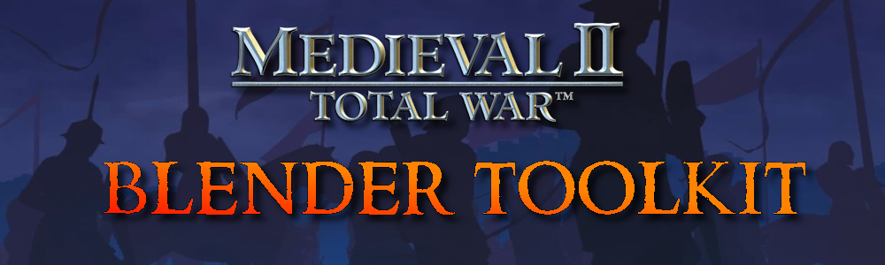
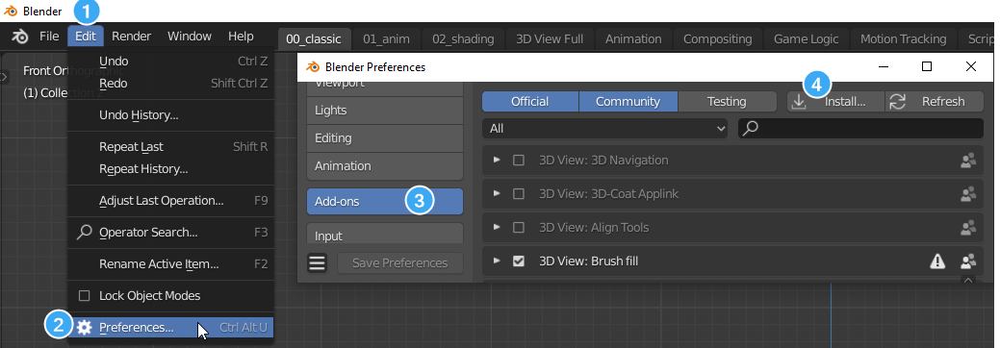
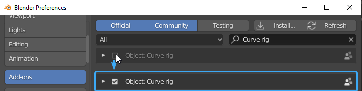

# Medieval 2: Total War - Blender Toolkit

This Blender addon is a complete asset pipeline for Medieval II: Total War modding. It imports the game's units, models and settlements straight into Blender, and exports finished models back into the game's formats — including textures, normal maps and a ready-made `battle_models.modeldb` entry — with IWTE handling the final `.mesh` conversion.

The addon is organised into four **workmodes**, selected from a dropdown at the top of the toolkit panel (N-panel → Medieval 2 Toolkit). Each workmode shows only the panels relevant to that stage of the pipeline.

***

 

## Table of Contents
* [Features](#features)
* [Usage](#usage)
* [Installation](#installation)
* [Credits](#credits)

## Features

### Unit Import
Read any mod's data folder and pull its content into Blender:
- Batch import every unit of a faction, or import single units and officers
- Import models directly from the battle_models.modeldb (BMDB) with filtering
- EDU-based unit browser with mount / officer / upgrade handling
- Unit card renderer setup and unit variation randomizer
- Batch import strategy `.cas` models

### Unit Export
Take a rigged model from Blender back into the game:
- One-click **Check Model for Export**: auto-fixes naming (`.001` suffixes, `x__y` part naming), collapses duplicate materials and material slots, validates weights, texture sizes and UV layout before anything leaves Blender
- Per-texture UV checking: main-texture objects must sit in the first UV tile, attach-texture objects in the tile to the right, with an option to auto-select offending objects in the UV editor
- GLB export with automatic texture conversion to the game's `.texture` format (DXT5, via bundled texconv)
- Output renaming for all textures, and blank normal-map generation for materials without one
- BMDB entry generator: faction ownership toggles, sprite/footer copying from existing units, duplicate-entry warning against the mod's modeldb
- GLB → `.mesh` conversion driven through IWTE task files, with progress monitoring
- All export settings are stored per-armature, so multiple units can live in one .blend

### Settlements
- Import settlement `.world` models through IWTE
- Browse and sort the mod's settlement packs

### QOL (rigging & cleanup tools)
- Weight transfer between meshes with selectable vertex mapping
- Parent meshes to bundled game skeletons: plain parenting, rigging with sample body weights, or a full setup that also brings in equipment props
- Rename tools: clean `.001` number suffixes, switch bone case (`_R/_L` ↔ `_r/_l`), apply/swap game part prefixes (`weapon0__`, `shield0__`, ...), toggle the `__opt` optional-part suffix
- SimpleBake helpers for texture baking workflows

## [Usage](https://docs.google.com/document/d/1sjLq0buiZpiRU4AwekeG9lYVo7wYgm7mhbN25glYwIc)
For usage instructions, please refer to this [Google Doc](https://docs.google.com/document/d/1sjLq0buiZpiRU4AwekeG9lYVo7wYgm7mhbN25glYwIc)

## Installation

## 1. Download the release
Navigate to the [latest release](https://github.com/WK-313/Medieval-2-Toolkit/releases/latest) and download the zip file under the **Assets** section

## 2. Install the addon
Point it at the downloaded .zip file

## 3. Enable the addon
Enable `Medieval 2 Toolkit`

## Credits
- `WK | Kautto Ville`
    - Discord: `wk__`
- `ProJYeet` — Unit Export and QOL workmodes, BMDB writer, importer fixes
